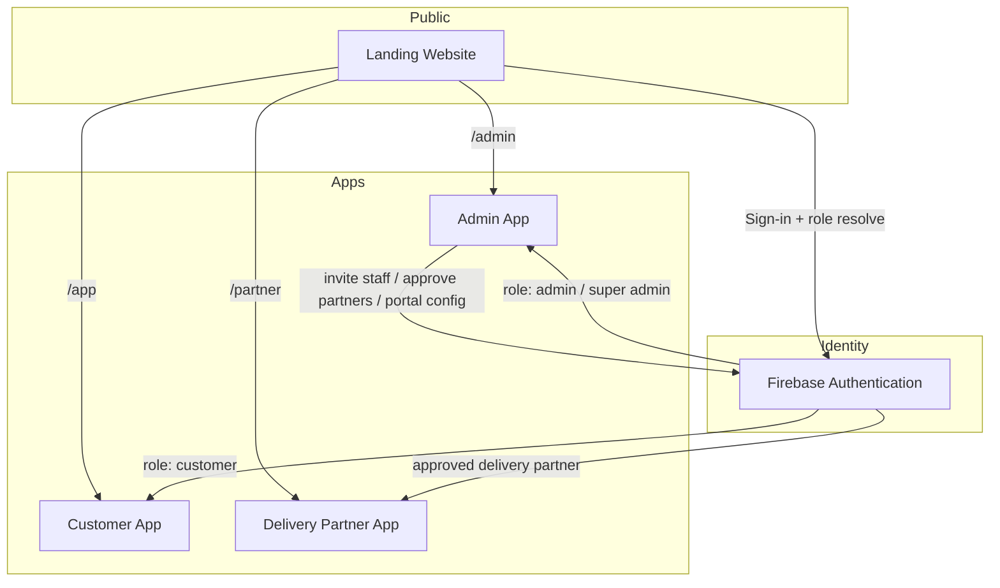

# Taaza Bites

**Chef-crafted healthy meal subscriptions — delivered fresh across Bengaluru.**

Taaza Bites is a multi-application food-tech platform that powers the full subscription lifecycle: acquisition on the marketing site, customer self-serve subscriptions, kitchen and operations control, and last-mile delivery partner execution.

---

## Overview

The platform is organized as an **npm workspaces monorepo** with four applications that share one public host, a common authentication project, and role-based entry paths.

| Public URL | App | Responsibility |
|------------|-----|----------------|
| `https://www.taazabites.in` | Landing | Public website, SEO surfaces, CTAs, and authenticated portal routing |
| `https://www.taazabites.in/app` | Customer | Subscriptions, meal plans, account, wallet, and self-serve flows |
| `https://www.taazabites.in/admin` | Admin | Operations console with RBAC and a Super Admin control plane |
| `https://www.taazabites.in/partner` | Delivery | Partner-facing app for assignments, tracking, and earnings |

```text
taaza-bites/
├── apps/
│   ├── landing/      # Marketing + portal hub
│   ├── customer/     # Subscriber experience
│   ├── admin/        # Ops + Super Admin
│   └── delivery/     # Delivery partner app
└── package.json      # Workspace root
```

---

## Architecture

### High-level flow



### Design principles

- **Separation of concerns** — each persona gets a dedicated app instead of one overloaded SPA  
- **Shared identity, scoped data** — one Firebase Auth project; domain-specific Firestore databases  
- **One public host** — landing is the website; customer, admin, and delivery are path prefixes on the same origin  
- **Hub-and-spoke entry** — the landing site is the public front door; deep links and role checks route users correctly  
- **Least privilege** — delivery partners cannot self-provision; staff require invites; Super Admin owns elevated controls  

---

## Features

### Customer experience
- Subscription plan discovery and checkout integrations  
- Meal preferences, schedules, and account management  
- Wallet / rewards surfaces (product-dependent modules)  
- Mobile-friendly flows with progressive enhancement  

### Operations (Admin)
- Orders, kitchen, inventory, subscriptions, finance, and support modules  
- Role-based access control (e.g. Kitchen Manager, Delivery Manager, Finance, CRM)  
- Audit-oriented admin workflows and session-aware auth  

### Super Admin control plane
- Staff invitations with claim-on-first-login (`adminInvites` → `admins/{uid}`)  
- Delivery partner registration, approval, and blocking  
- Cross-app customer account mapping  
- Runtime portal URL configuration and feature flags  

### Delivery partners
- Phone OTP authentication  
- Access gated on an approved partner profile  
- Deliveries, status updates, and earnings views  

### Platform integrations

| Capability | Provider |
|------------|----------|
| Authentication & realtime data | Firebase Auth, Cloud Firestore |
| Payments | Razorpay |
| WhatsApp messaging | Gupshup |
| Transactional email | Brevo (SMTP / API) |
| Maps & logistics helpers | Google Maps Platform |
| Generative AI | Google Gemini |

---

## Tech stack

| Layer | Technologies |
|-------|----------------|
| Client | React 19, TypeScript, Vite, Tailwind CSS |
| Server | Node.js, Express (per-app servers where required) |
| Identity & data | Firebase Auth, Firestore |
| AI | Google Gemini (`@google/genai`) |
| Repo layout | npm workspaces (`@taazabites/*` packages) |

**Workspace packages:** `@taazabites/landing` · `@taazabites/customer` · `@taazabites/admin` · `@taazabites/delivery`

---

## Getting started

### Requirements

- Node.js **20+**
- npm **10+**
- A Firebase project with Email/Password and/or Phone Auth enabled  
- API keys for optional integrations (Razorpay, Gemini, Maps, etc.)

### Install dependencies

```bash
cd apps/landing && npm install
cd ../customer && npm install
cd ../admin && npm install
cd ../delivery && npm install
```

### Environment

Copy each app’s example env file and fill values:

```bash
cp apps/landing/.env.example apps/landing/.env
cp apps/customer/.env.example apps/customer/.env
cp apps/admin/.env.example apps/admin/.env
cp apps/delivery/.env.example apps/delivery/.env
```

**Landing portal wiring** (`apps/landing/.env`) — same-origin paths:

```env
VITE_CUSTOMER_URL=/app
VITE_ADMIN_URL=/admin
VITE_DELIVERY_URL=/partner
VITE_ROLE_API_URL=/api/me
```

**Admin server (optional but recommended for Super Admin APIs):**

```env
FIREBASE_PROJECT_ID=
FIREBASE_CLIENT_EMAIL=
FIREBASE_PRIVATE_KEY=
```

### Run development servers

Start all four processes. Open **only the landing host** — it proxies the other apps:

| Public URL | App | Upstream |
|------------|-----|----------|
| http://localhost:3002 | Landing (gateway) | — |
| http://localhost:3002/app | Customer | :3000 |
| http://localhost:3002/admin | Admin | :3001 |
| http://localhost:3002/partner | Delivery | :3003 |

Windows PowerShell:

```powershell
cd apps/admin;    npm run dev
cd apps/customer; npx vite --port=3000 --host=0.0.0.0
cd apps/delivery; npm run dev
cd apps/landing;  npm run dev
```

From the monorepo root (after workspace install):

```bash
npm run dev:admin
npm run dev:customer:ui
npm run dev:delivery
npm run dev:landing
```

---

## Role model

| Persona | How access is granted | Primary app |
|---------|----------------------|-------------|
| Customer | Self-serve signup / login | Customer |
| Delivery partner | Super Admin registers & approves profile | Delivery |
| Staff (Kitchen, Ops, Finance, …) | Super Admin invite → first login claims profile | Admin |
| Super Admin | Bootstrap allowlist + `admins/{uid}` | Admin (`/super-admin`) |

Staff invites are stored under `adminInvites` and materialized as `admins/{uid}` when the user authenticates for the first time. Delivery partners without an approved `deliveryPartners/{uid}` document are rejected at the gate.

---

## API surface (Admin)

| Endpoint | Purpose |
|----------|---------|
| `GET /api/me` | Authenticated role + portal resolution (Bearer Firebase ID token) |
| `GET/PUT /api/super-admin/portals` | Portal URLs & feature flags |
| `GET/POST/PATCH /api/super-admin/partners` | Partner list / register / block |
| `GET/POST /api/super-admin/customer-map` | Link customer identities across systems |

When Firebase Admin credentials are missing, role resolution falls back to client-side Firestore reads from the landing app.

---

## Security

- Secrets (`.env`, private keys) are excluded via `.gitignore`  
- Firestore security rules enforce admin/partner ownership and Super Admin writes  
- Delivery self-registration is disabled by product policy  
- Production deployments should publish `apps/admin/firestore.rules` (and related app rules) to Firebase  

---

## Roadmap (optional)

- [ ] Unify named Firestore databases into a single shared data plane  
- [ ] Cross-subdomain SSO session sharing for production domains  
- [ ] Expanded automated test coverage across workspace packages  
- [ ] CI pipelines for lint, typecheck, and build per app  

---

## Contributing

1. Create a feature branch from `main`  
2. Keep changes scoped to the relevant `apps/*` package when possible  
3. Do not commit credentials or production service accounts  
4. Open a pull request with a clear summary and test notes  

---

## License

Proprietary. All rights reserved unless otherwise specified by the repository owner.
